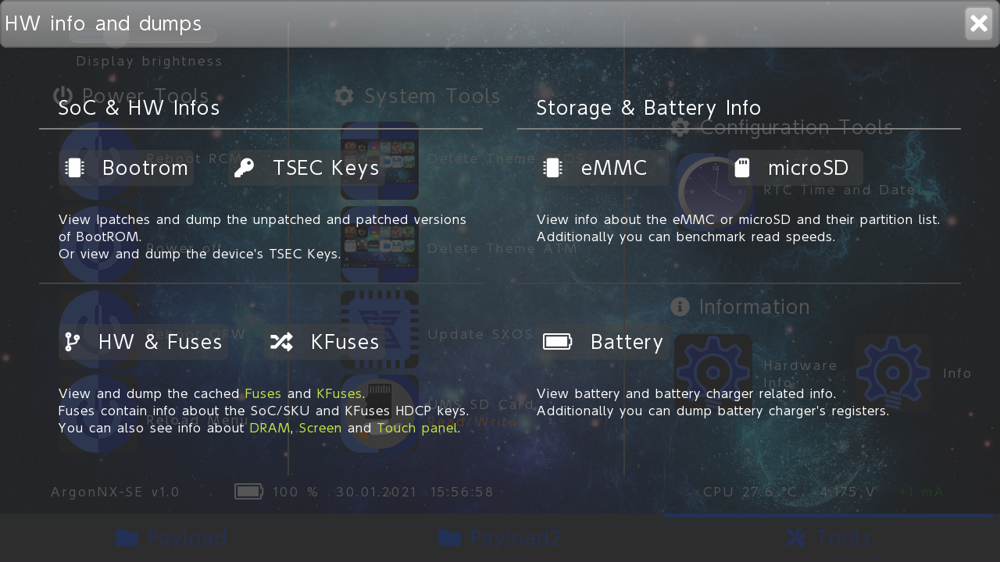

ArgonNX-SE


## What Argon is?

Argon is a noble gas.
"Argon" comes from Greek "Argon", neuter of "argos" meaning *lazy* , *idle* or *inactive*.
Argon recieved this name because of its chemical inactivity.

Argon NX is an immutable payload which is injected to your Nintendo Switch via Fusee Gelee exploit.

## Purpose 

The purpose of Argon NX is to stay immutable, so you can always inject it, without caring about other payloads getting updated (Always use ArgonNX for TegraSmash, TegraGUI, TrinkedM0...).

## How can it be immutable?

When Argon NX is injected, Argon NX will list all payloads located at `argon/payloads`, and you will be able to select one of them to launch it.

Autolaunch Payload:

If the file "autolaunch.bin" (your payload) is in the "argon" folder, this payload should start.
(Volume -) hold during the payload run, starts ArgonNX-SE...

## Features

ArgonNX will list all the payloads located at `argon/payloads`, so you can select one of them to launch it.
- **Customize payloads' logos**. **Logos must be smaller or equal than 280x280** (See About BMP format section). Example:

```
argon
  ├───logos
  │     fusee-primary.bmp # Logo for fusee-primary.bin payload
  │     ReiNX.bmp # Logo for ReiNX.bin payload
  │
  └───payloads
        fusee-primary.bin
        ReiNX.bin         
        hekate.bin # Will be rendered using default logo
```

- **Custom backgrounds** can be added by placing `background.bmp` file inside `argon` directory. **The background must be smaller or equal than 1280x720**.
- Take **screenshots** to share your ArgonNX gui. To capture ArgonNX screen tap anywhere with three fingers or use Capture Button on Joycon.
- Touch support. Thanks to @pixel-stuck
- Simple tools.

## NEW Features in ArgonNX-SE v1.0 by Storm

- Build with newest hekate HW Libs
- Mariko Support
- Joycon Mouse
- UMS SD Card
- Theme delete SX
- Theme delete ATM
- Update SX
- Set RTC Time and Date
- Status Bar: Battery, Time and Date, Temperatur Info, Power Infos
- Hardware info Page
- Reload Menü

## NEW Features in ArgonNX-SE v1.1 by Storm

- Autolaunch Payload:
If the file "autolaunch.bin" (your payload) is in the "argon" folder, this payload should start.
(Volume -) hold during the payload run, starts ArgonNX-SE...

## NEW Features in ArgonNX-SE v1.2 by Storm

- Update SX removed
- Added Filemanager for Argon and Emunandswitcher
- Added Reboot Menu with Power Button

Key assignment usage Filemanager:
- Touch screen as usual
- Joycon Mouse, A = Enter folder / Choose Buttons, B = Back Folder, X = Close Window
- Joypad up / down Filelist navigation, A = Enter folder, B = Back Folder, X = Close Window

## Neue Funktionen in ArgonNX-SE v1.2 by Storm

- Update SX entfernt
- Filemanager für Argon und Emunandswitcher hinzugefügt
- Reboot Menu mit Power Button hinzugefügt

Tastenbelegung Bedienung Filemanager:
- Touch screen wie gewohnt
- Joycon Mouse, A = Eingang Ordner / Button wählen, B = Ordner zurück, X = Fenster schliessen
- Joypad up / down Dateiliste navigation, A = Eingang Ordner, B = Ordner zurück, X = Fenster schliessen

## NEW Features in ArgonNX-SE v1.3 by Storm

- Build with newest hekate HW Libs 5.5.7
- Some Buttons Theme fix
- Fixed a Error after autoclosing a window with X Button (Close Filemanager and other Windows)


## NEW Features in ArgonNX-SE v1.4 by Storm

- Update to hekate bdk 5.7.2
- AULA OLED Switch support
- Hardware Info Page revised
- Fix slider brightness value for AULA
- Added language selection
- Updated to 1.4
- General bug fixes and stability fixes

Thanks @dezem und https://gbatemp.net/members/twocool4life86.591345/ for the AULA OLED tests, without them this version would not have been possible!

## Neue Funktionen in ArgonNX-SE v1.4 by Storm

- Update auf hekate bdk 5.7.2
- AULA OLED Switch support
- Hardware Info Page überarbeitet
- Fix Slider Helligkeits Value auslesen für AULA
- Sprachauswahl hinzugefügt
- Update zu 1.4
- Allgemeine Fehlerbehebung und Stabilitäts Fixes

Danke an @dezem und https://gbatemp.net/members/twocool4life86.591345/ für die AULA OLED  Tests, ohne sie wäre diese Version nicht möglich gewesen!


## NEW Features in ArgonNX-SE v1.5 by Storm

- Menu colors can now be set arbitrarily:
- Textcolor
- Tab Textcolor
- Standard Payload Icon color

- New icons for Emunandswitcher and ArgonNX-SE itself
- Updated to 1.5
- General bug fixes and stability fixes

## Neue Funktionen in ArgonNX-SE v1.5 by Storm

- Menü Farben können nun beliebig eingestellt werden:
- Textfarbe
- Tab Textfarbe
- Standart Payload Icon Farbe

- Neue Icons für Emunandswitcher und ArgonNX-SE selber
- Update zu 1.5
- Allgemeine Fehlerbehebung und Stabilitäts Fixes


## NEW Features in ArgonNX-SE v1.6 by Storm

- File manager, copy file and folder added percentage display, autoclose info window after copying
- Updated to 1.6
- General bug fixes and stability fixes

## Neue Funktionen in ArgonNX-SE v1.6 by Storm

- Dateimanager, Datei und Ordner kopieren Prozentanzeige hinzugefügt, autoschliessen des Infofensters nach dem kopieren
- Update zu 1.6
- Allgemeine Fehlerbehebung und Stabilitäts Fixes


## NEW Features in ArgonNX-SE v1.7 by Storm

- New function to select the autolaunch payload under tools. The desired payload is automatically copied and renamed. And the ability to delete the autolaunch payload.
- Updated to 1.7
- General bug fixes and stability fixes

## Neue Funktionen in ArgonNX-SE v1.7 by Storm

- Neue Funktion um den Autolaunch Payload unter Tools auszuwählen. Der gewünschte Payload wird automatisch kopiert und umbenannt. Und die Möglichkeit den Autolaunch Payload zu löschen.
- Update zu 1.7
- Allgemeine Fehlerbehebung und Stabilitäts Fixes


## NEW Features in ArgonNX-SE v1.8 by Storm

- New feature: Ability to load a custom splash for each payload
- The image must have a resolution of 1280x720px and format ARGB32, like background.bmp
- The image must have the same name as the payload and be located in the "argon/payloads" folder, e.g. at fusee.bin = fusee.bmp

## Neue Funktionen in ArgonNX-SE v1.8 by Storm

- Neue Funktion: Möglichkeit für jeden Payload einen benutzerdefinierten Splash zu laden
- Das Bild muss eine Auflösung von 1280x720px und format ARGB32 besitzen, wie background.bmp
- Das Bild muss den gleichen Namen wie der Payload haben und sich im Ordner "argon/payloads" befinden, z.B. bei fusee.bin = fusee.bmp


## About BMP format

The only format supported is **BMP 32 bit ARGB color**.
ArgonNX recommends using a solid background without alpha channel (alpha channel set to 0xFF). Payloads' logos **support alpha channel**.

### Generate new logos and background

ArgonNX provides a useful Command Line Interface (CLI) to create new logos and backgrounds for your payloads using a *jpg* or *png* images.

#### CLI installation

The Argon CLI is written in Python. To install python follow the instructions listed [here](https://realpython.com/installing-python/). Once you have python3 installed just type the following commands (These will install the requirements for running the CLI):

```bash
$ cd scripts
$ pip install -r requirements.txt
$ sudo apt-get install libmagickwand-dev
```

> If you are using Windows visit [Wand's installation page](http://docs.wand-py.org/en/0.4.1/guide/install.html) and follow the steps to install libmagikcwand on Windows.

#### CLI Usage

To generate a new logo use the following command.

```bash
$ cd scripts
$ python argon.py img-to-logo <path-to-png-jpg-img>
```

To generate a new background use the following command.

```bash
$ cd scripts
$ python argon.py generate-background <path-to-png-jpg-img>
```

The CLI stores the outputs of the commands at the recently created (also by the CLI) `sd-files/argon` directory (This directory simulates an sd-card argon structure).

To learn more about the CLI options type:

```bash
$ python argon.py --help
```

## GUI

These images were captured with the **screenshot** feature.





As you can see in the pictures, payloads are displayed in groups of 8 and each group is displayed in a different *payloads* tab. Maximum 16 Payloads, Two Tabs...

You can find the logos used in the pictures inside [this directory](img/example-custom/logos) and backgrounds [here](img/example-custom/backgrounds). And in the Release files.

## ArgonNX sd card tree

How a full running ArgonNX example looks inside the sd card:

```
argon
├─── payloads
│       Atmosphere.bin
│       ReiNX.bin
│       fusee-gelee.bin
│       hekate.bin
│       SXOS.bin
│
├─── logos
|       Atmosphere.bmp
|       Reinx.bmp
|       hekate.bmp
|       SXOS.bmp
|
├─── sys
|       argon-nx-gui.bin # Menu
|       minerva.bso # IMPORTANT if you want a good UX experience
|       res.emunsw # IMPORTANT. Binary file containing all render resources except the background and logos
|       hw.ini
|       lp0.bso
|       logos-gui
|       lang.ini
|       color.ini
|
└─── background.bmp
     splash.bmp
```

## Improve performance

ArgonNX can use **minerva training cell** to improve performance.
The use of minerva is optional but recommended. To use minerva just place the compiled `minerva.bso` inside `argon/sys`. The directory `argon/sys` with minerva, is included in `sd-files.zip` in the release section.

To learn more about Minerva Training Cell check its [official repo](https://github.com/CTCaer/minerva_tc).

## Compatibility

This payload will chainload any CFW or payload. 


## Credits

* __devkitPro__ for the [devkitA64](https://devkitpro.org/) toolchain.
* __naehrwert__ and __st4rk__ for the original [hekate](https://github.com/nwert/hekate) project and its hwinit code base.
* __CTCaer__ for the continued [hekate](https://github.com/CTCaer/hekate) and his **minerva** project.
* __xalgovia__ and __Retrogamer 74__ for the splash and logos. Also thanks them to use ArgonNX in RetroReloaded.
* __langerhans__ and  __stuck-pixel__ for their implementation of touch support.
* __LittlevGL__ for being such a good embedded graphics library.
* __D3fau4__ for touch support testing.
* __Guillem96__ for argonNX Orginal.
* __mrdude__ for icons template.
* __Muxi1__ for Mariko testing.
